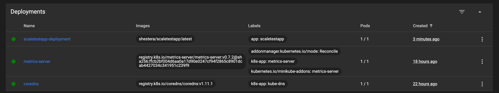
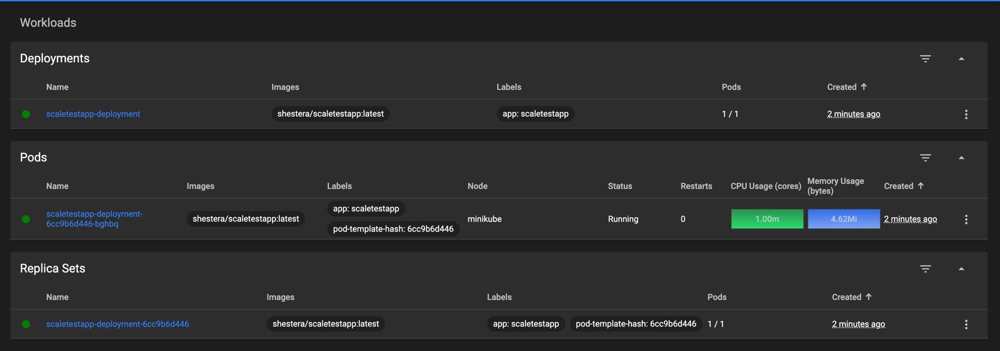
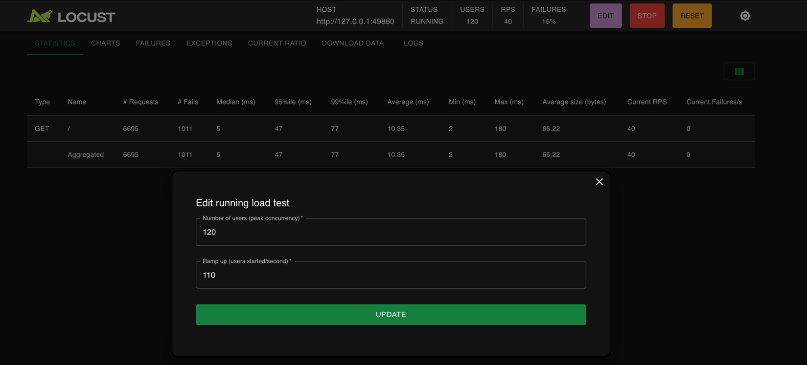
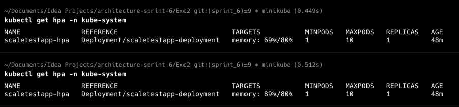
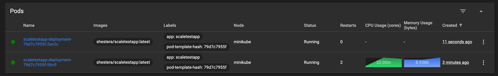

# architecture-sprint-6

## Задание 1. Проектирование технологической архитектуры

[Ссылка на финальную схему](Exc1/InureTech_%D1%82%D0%B5%D1%85%D0%BD%D0%BE%D0%BB%D0%BE%D0%B3%D0%B8%D1%87%D0%B5%D1%81%D0%BA%D0%B0%D1%8F%20%D0%B0%D1%80%D1%85%D0%B8%D1%82%D0%B5%D0%BA%D1%82%D1%83%D1%80%D0%B0_to-be.drawio)

Из-за высоких требований к доступности и отказоустойчивости приложения было выбрано решение с горизонтальным масштабированием и реализацией мульти-ЦОД модели с отдельными кластерами kubernetes в каждом ЦОД. Отдельные кластеры выбраны из-за того что этот подход снижает зависимость от сетевой связанности между ЦОД и от внутренних недостатков фейловер-механизмов в Kubernetes, что особенно актуально для ситуаций, когда площадки располагаются далеко.
Трафик к БД при этом направляется через pgbouncer, что дает возможность распределять запросы на чтение и запись в нужных направлениях. Схема с мульти-мастером БД тут выглядит излишней, однако, это тоже можно реализовать вместе с шардированием БД. На данном этапе же хватит pgbouncer с автоматическим определением мастера и направлением трафика на нужные реплики. 
Вертикальное масштабирование в рамках 1 цод в данном кейсе не даст высоких результатов из-за того, могут случиться непредвиденные события, которые выведут данный ЦОД из работы, что очень пагубно скажется на бизнесе.

## Задание 2. Динамическое масштабирование контейнеров
[deployment.yaml](Exc2/deployment.yaml)

[locustfile.py](Exc2/locustfile.py)

## Задание 3. Переход на Event-Driven архитектуру
[Описание решения](Exc3/Readme.md)

[Итоговая схема](Exc3/InsureTech_C4_%D1%81ontainer-diagram.drawio.xml)